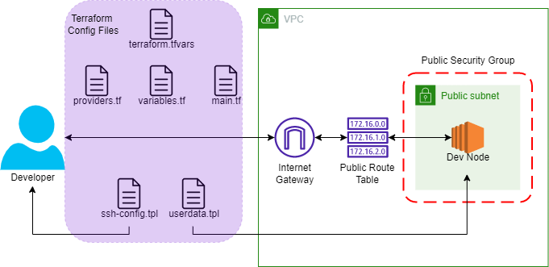

# Building a Development Environment in AWS with Terraform
### By Derek Morgan via freeCodeCamp

You can find the full free course on Youtube here: [Learn Terraform (and AWS) by Building a Dev Environment – Full Course for Beginners](https://www.youtube.com/watch?v=iRaai1IBlB0&t=1272s)

### Diagram
