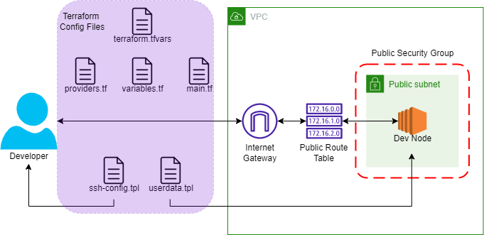

# Terraform Project:
## Learn Terraform (and AWS) by Building a Dev Environment – Full Course for Beginners
### By Derek Morgan via freeCodeCamp

You can find the full free course on [YouTube](https://www.youtube.com/watch?v=iRaai1IBlB0&t=1272s)

### Building a Development Environment in AWS with Terraform
